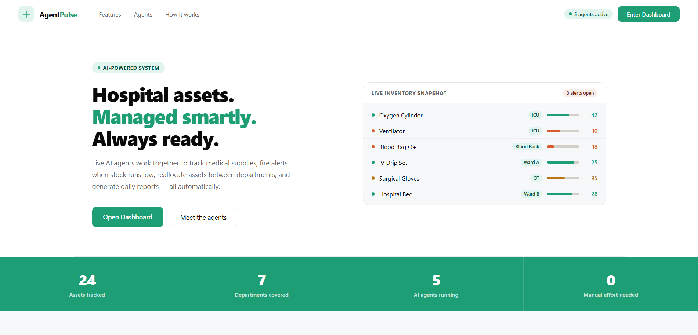
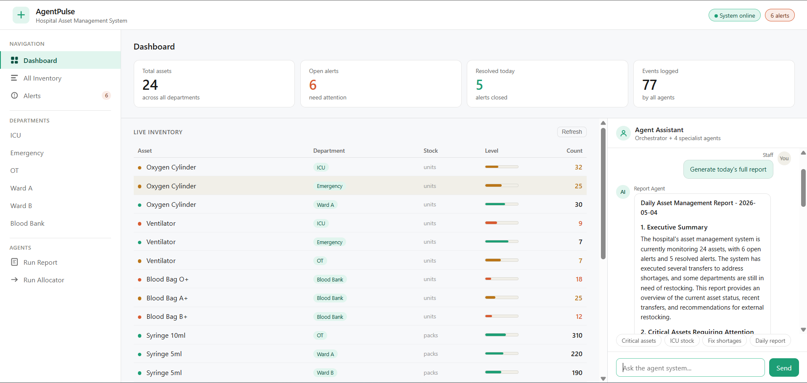

<div align="center">


<br/><br/>

```
   _                    _   ____        _
  / \   __ _  ___ _ __ | |_|  _ \ _   _| |___  ___
 / _ \ / _` |/ _ \ '_ \| __| |_) | | | | / __|/ _ \
/ ___ \ (_| |  __/ | | | |_|  __/| |_| | \__ \  __/
/_/   \_\__, |\___|_| |_|\__|_|    \__,_|_|___/\___|
        |___/
```

# 🏥 AgentPulse
### *Hospital assets. Managed smartly. Always ready.*

**Five AI agents working 24/7 — tracking, alerting, allocating, and reporting hospital assets automatically.**

[](https://github.com/YOUR_USERNAME/agentpulse)
[](https://github.com/YOUR_USERNAME/agentpulse/fork)

</div>

---

## 🌟 What is AgentPulse?

> AgentPulse is an **AI-powered Hospital Asset Management System** where multiple intelligent agents collaborate to monitor medical supplies, fire alerts, reallocate assets between departments, and generate reports — **all automatically, with zero manual effort.**

No more spreadsheets. No more manual checks. Just smart agents doing the work.

---

## 🖥️ Interface

### 🏠 Landing Page


### 📊 Dashboard


---

## 🤖 Meet the 5 AI Agents

| Agent | Role | What it does |
|-------|------|-------------|
| 🧠 **Orchestrator** | The Boss | Coordinates all agents, decides who does what |
| 📦 **Inventory Agent** | The Tracker | Monitors stock levels across all departments |
| 🚨 **Alert Agent** | The Watchdog | Fires alerts when stock runs critically low |
| 🔄 **Allocator Agent** | The Mover | Reallocates assets between departments smartly |
| 📋 **Report Agent** | The Reporter | Generates daily asset management reports |

---

## ✨ Features

- 🤖 **Multi-Agent AI System** — 5 specialized agents working together
- 📊 **Live Inventory Dashboard** — Real-time stock view across all departments
- 🚨 **Smart Alerts** — Automatic low-stock detection and notifications
- 🔄 **Auto Reallocation** — AI moves assets where they're needed most
- 📋 **Daily Reports** — Auto-generated summaries with insights
- 🏥 **Multi-Department** — ICU, Emergency, OT, Ward A, Ward B, Blood Bank
- 💬 **Agent Chat** — Talk to the AI agent system directly
- 🍃 **MongoDB Storage** — All data stored and tracked in the cloud

---

## 🛠️ Tech Stack

| Technology | Purpose |
|-----------|---------|
| 🐍 Python | Core backend language |
| ⚡ Groq LLM | AI brain powering all agents |
| 🍃 MongoDB | Cloud database for all asset data |
| 🌐 Flask | Web framework for the UI |
| 🎨 HTML/CSS | Frontend interface |

---

## 📁 Project Structure

```
AgentPulse/
│
├── 🤖 agents/
│   ├── orchestrator.py      # Controls all agents
│   ├── inventory_agent.py   # Tracks stock levels
│   ├── alert_agent.py       # Fires low-stock alerts
│   ├── allocator_agent.py   # Reallocates assets
│   └── report_agent.py      # Generates reports
│
├── 📊 data/
│   └── seed_data.py         # Sample hospital data
│
├── 🎨 templates/
│   ├── index.html           # Dashboard UI
│   └── landing.html         # Landing page
│
├── 🔧 utils/
│   ├── db.py                # MongoDB connection
│   └── memory.py            # Agent memory system
│
├── ⚙️ app.py                # Main app entry point
├── 📋 requirements.txt      # Dependencies
└── 🔐 .env                  # Environment variables
```

---

## 🚀 Getting Started

### 1. Clone the Repository
```bash
git clone https://github.com/YOUR_USERNAME/agentpulse.git
cd agentpulse
```

### 2. Install Dependencies
```bash
pip install -r requirements.txt
```

### 3. Setup Environment Variables
Create a `.env` file in the root folder:
```env
MONGO_URI=your_mongodb_connection_string
GROQ_API_KEY=your_groq_api_key
```

### 4. Seed the Database
```bash
python data/seed_data.py
```

### 5. Run the App
```bash
python app.py
```

### 6. Open in Browser
```
http://localhost:5000
```

---

## 📊 Live Stats

| Metric | Value |
|--------|-------|
| 🏥 Assets Tracked | 24 |
| 🏢 Departments | 7 |
| 🤖 AI Agents | 5 |
| 👷 Manual Effort | 0 |

---

## 🔐 Environment Variables

| Variable | Description |
|----------|-------------|
| `MONGO_URI` | Your MongoDB Atlas connection string |
| `GROQ_API_KEY` | Your Groq API key for LLM access |

> ⚠️ **Never share your `.env` file or commit it to GitHub!**

---

## 🤝 Contributing

1. Fork the repository
2. Create your feature branch (`git checkout -b feature/AmazingFeature`)
3. Commit your changes (`git commit -m 'Add some AmazingFeature'`)
4. Push to the branch (`git push origin feature/AmazingFeature`)
5. Open a Pull Request

---

## 📄 License

Distributed under the MIT License. See `LICENSE` for more information.

---

<div align="center">

Made with ❤️ and 🤖 by **Sanikak99**

⭐ **Star this repo if you found it helpful!** ⭐

</div>
